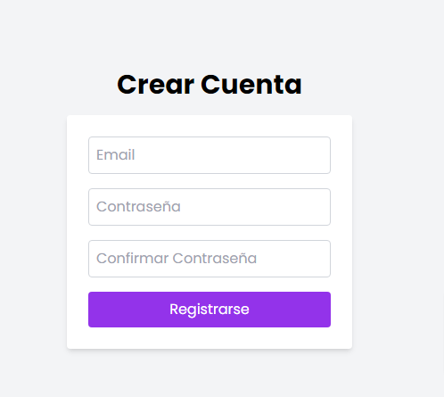
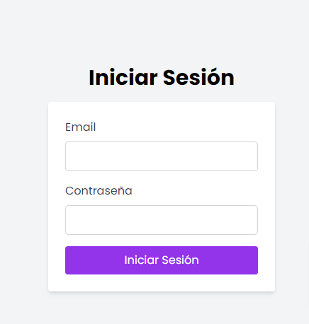
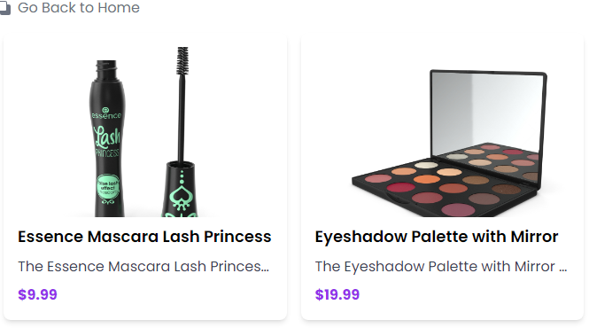

# React + Vite
Hoy, implementamos y estilizamos los formularios de inicio de sesión y registro utilizando Tailwind CSS, asegurando un diseño responsivo y amigable para el usuario. Además, comenzamos a desarrollar la página de productos, creando componentes para listar productos y mostrar información relevante. Se mejoró la experiencia visual con efectos de hover y un diseño limpio. 

